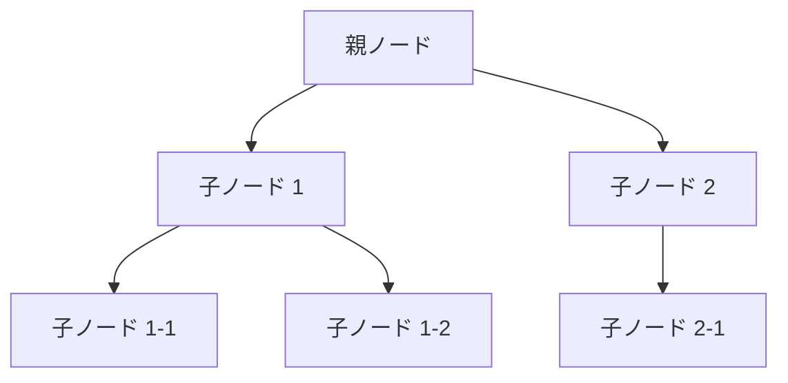

🌐web-installer of my startup and my utility.

🗺️Setup VPN,RP Server,my favorite softwares
🗺️Setup my original UTIL

🎯AlmaLinux
🎯Android Termux

🎨wireguard
🎨tigervnc
🎨xrdp
🎨xfce4




```python
def hello_world():
    print("Hello, World!")
```
上記のように、言語名（ここでは `python`）をコードブロックの開始行に指定することで、シンタックスハイライトを有効にできます。

- Python: `python`
- JavaScript: `javascript`
- Java: `java`
- C++: `cpp`
- Ruby: `ruby`
- HTML: `html`
- CSS: `css`
- SQL: `sql`
- JSON: `json`
- Shell: `bash`

### 2. **リスト形式や構造体を表現するコードブロック**
```markdown
```json
{
  "name": "Alice",
  "age": 25,
  "isStudent": false
}
