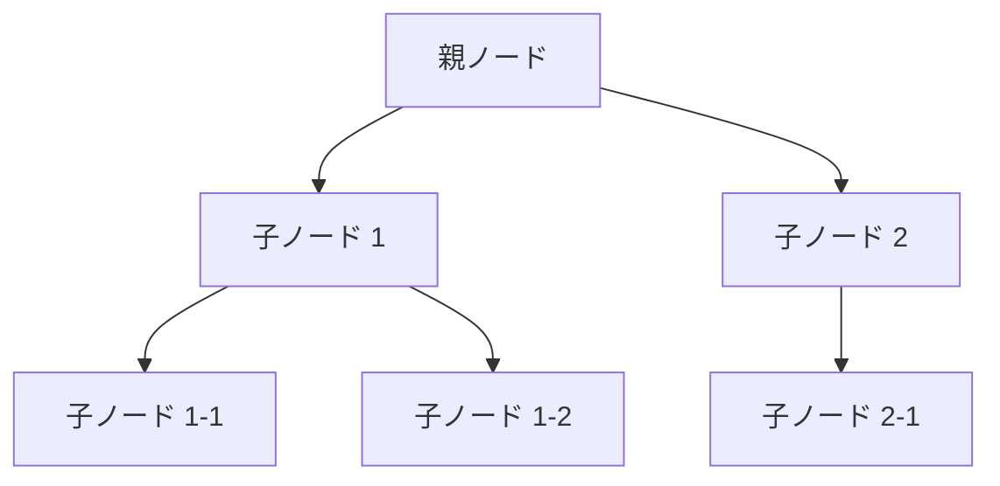

🌐web-installer of my startup and my utility.

🗺️Setup VPN,RP Server,my favorite softwares
🗺️Setup my original UTIL

🎯AlmaLinux
🎯Android Termux

🎨wireguard
🎨tigervnc
🎨xrdp
🎨xfce4




```python
def hello_world():
    print("Hello, World!")
