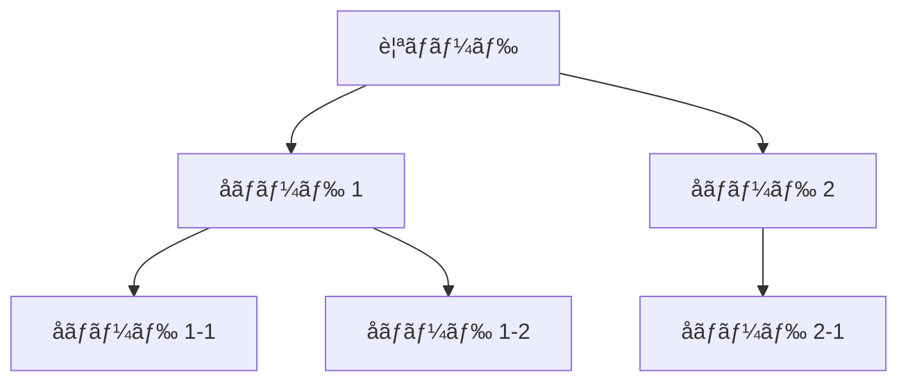

ğŸŒweb-installer of my startup and my utility.

🗺ï¸Setup VPN,RP Server,my favorite softwares
🗺ï¸Setup my original UTIL

ğŸ¯AlmaLinux
ğŸ¯Android Termux

ğŸ¨wireguard
ğŸ¨tigervnc
ğŸ¨xrdp
ğŸ¨xfce4



```mermaid
graph TD;
    A[親ãƒãƒ¼ãƒ‰] --> B[å­ãƒãƒ¼ãƒ‰ 1];
    A --> C[å­ãƒãƒ¼ãƒ‰ 2];
    B --> D[å­ãƒãƒ¼ãƒ‰ 1-1];
    B --> E[å­ãƒãƒ¼ãƒ‰ 1-2];
    C --> F[å­ãƒãƒ¼ãƒ‰ 2-1];
```

```python
def hello_world():
    print("Hello, World!")
```
上記ã®ã‚ˆã†ã«ã€è¨€èªå（ã“ã“ã§ã¯ `python`）をコードブロックã®é–‹å§‹è¡Œã«æŒ‡å®šã™ã‚‹ã“ã¨ã§ã€ã‚·ãƒ³ã‚¿ãƒƒã‚¯ã‚¹ãƒã‚¤ãƒ©ã‚¤ãƒˆã‚’有効ã«ã§ãã¾ã™ã€‚

- Python: `python`
- JavaScript: `javascript`
- Java: `java`
- C++: `cpp`
- Ruby: `ruby`
- HTML: `html`
- CSS: `css`
- SQL: `sql`
- JSON: `json`
- Shell: `bash`

### 2. **リスト形å¼ã‚„構造体を表ç¾ã™ã‚‹ã‚³ãƒ¼ãƒ‰ãƒ–ロック**

```json
{
  "name": "Alice",
  "age": 25,
  "isStudent": false
}
Mermaidコードを使ã£ã¦ã€ãƒ•ãƒ­ãƒ¼ãƒãƒ£ãƒ¼ãƒˆã‚„グラフをæç”»ã§ãã¾ã™ã€‚

### 4. **PlantUML（UML図用）**
```
```plantuml
@startuml
actor User
User -> System: Log in
System -> Database: Query user credentials
@enduml
